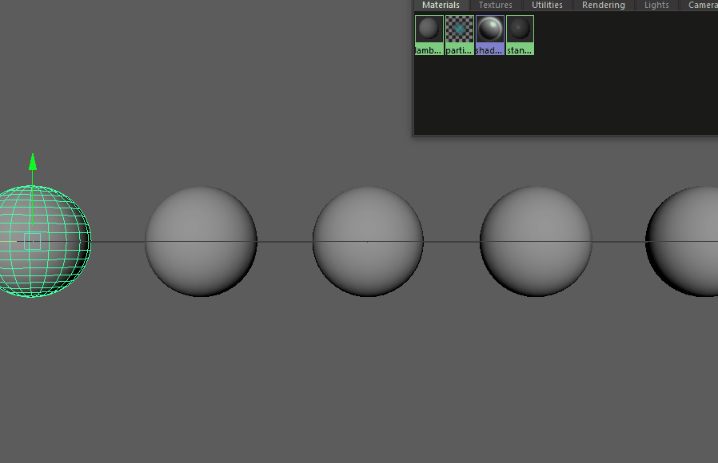

# EasyTextures
A small script for Autodesk Maya to quickly apply textures

## Installation

You can download the repository and simply place the python and mel file into your scripts folder.
The performFileDropAction.mel file overrides the default drag-and-drop behaviour of maya, if you don't want this. You can rename the file and add it to your shelve to enable it with a button.

## Special thanks

I'd like to thank [Meatplowz](https://gist.github.com/Meatplowz) for the drag-and-drop overriding example you can find [here](https://gist.github.com/Meatplowz/376d7483d557c47f2ef8bdf3023fdf16).
